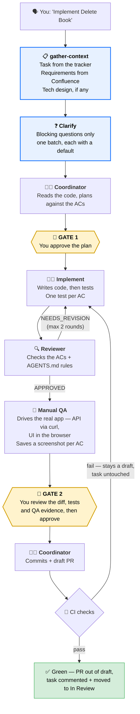

# 📚 Books API — Multi-Agent AI Demo

A **.NET 10 Clean Architecture** REST API with a **multi-agent AI setup** baked in. The app is intentionally minimal — one domain, one endpoint — so the focus stays on how the agents work together.

Needs [Claude Code](https://docs.anthropic.com/en/docs/claude-code), the [.NET 10 SDK](https://dotnet.microsoft.com/download/dotnet/10.0), [`gh`](https://cli.github.com/) for PRs and CI, and [Node.js](https://nodejs.org/) 20+ for the demo frontend. Everything in `.claude/` is picked up automatically.

Planning pulls requirements from two external systems over MCP: the task tracker, declared in [`.mcp.json`](.mcp.json), and Confluence, which comes from your own Atlassian connector rather than this repo. Without both connected, `gather-context` cannot fetch requirements and the cycle stalls before the first gate.

## 💡 Concepts

- 🤖 **Agent** — a sub-process with a focused role, its own prompt, and its own context window. Defined in `.claude/agents/*.md`.
- ⚡ **Skill** — a reusable workflow, invocable as a slash command. Defined in `.claude/skills/*/SKILL.md`.
- 📖 **AGENTS.md** — shared context every agent loads: architecture rules, naming conventions, patterns to follow.

## 🤔 Why multi-agent?

A single chat tries to plan, implement, review and test all at once — which means shortcuts, missed issues, and a context window that degrades as it grows. Sub-agents each run in **their own context window**, so every one stays focused. It mirrors a real team:

| Role | Human team | AI agent |
|------|-----------|----------|
| 🧑‍💼 Tech lead | Plans the approach, delegates, reviews scope | `coordinator` skill |
| 📋 Analyst | Pulls requirements before anyone plans | `gather-context` |
| 👨‍💻 Developer | Writes code and tests | `implement` |
| 🔍 Code reviewer | Catches bugs, checks standards | `reviewer` |
| 🧪 QA engineer | Verifies changes against a running app | `manual-qa` |

The boundaries are the point: the coordinator never writes code, the implementer never commits, the reviewer never edits files.

## ⚙️ How it works



Requirements drive the cycle, and the whole run leaves a paper trail in a gitignored `.adlc/<slug>/` folder:

```
.adlc/delete-book/
  plan.md      ← the approved plan, acceptance criteria copied verbatim
  review.md    ← every review round: the findings and the replies to them
  qa.md        ← per-criterion PASS/FAIL
  evidence/    ← a screenshot or API transcript named after each criterion
```

Every sub-agent reads that one plan, so the implementer, the reviewer and QA work from the same criteria instead of a retyped summary — and Gate 2 shows you artefacts, not assurances.

Two human gates keep you in control: nothing is implemented before you approve the plan, and nothing is committed or pushed before you approve the finished, tested work. Gate 2 states everything approval sets in motion — including that a green CI run takes the PR out of draft, comments a short summary on the tracker task and moves it to In Review. The loop closes where it started, and the comment says plainly that an agent wrote the code and it still needs human review before merge.

## 📁 What's in `.claude/`

```
agents/
  gather-context.md ← 📋 fetches tracker task + Confluence requirements
  implement.md      ← 👨‍💻 writes code and tests
  reviewer.md       ← 🔍 reviews against AGENTS.md rules and the ACs
  manual-qa.md      ← 🧪 tests the running app against the ACs
skills/
  coordinator/      ← ⚡ /coordinator — orchestrates the whole cycle
  run-locally/      ← ⚡ /run-locally — start the API and frontend
  docs-drift/       ← ⚡ /docs-drift — check docs against any diff
  ci-explorer/      ← ⚡ /ci-explorer — debug a red CI run
launch.json         ← ▶️ run configurations (API http/https/docker, frontend)
```

## 🎮 Try it

Implementation tasks go through the `coordinator` skill — name a feature from the tracker, or invoke `/coordinator` explicitly:

- *"Implement Delete Book"*
- *"Implement Edit Book"*
- *"Implement Create Book"*

Those are real tasks in the **ADLC Demo** project, each linked to its Confluence requirements — the coordinator fetches the acceptance criteria before it plans. (List Books and Book Details are already done.)

To run the app yourself, use `/run-locally`.

The agents are simple markdown files. Read them, tweak them, break them — that's the point of a demo project. 🛠️
