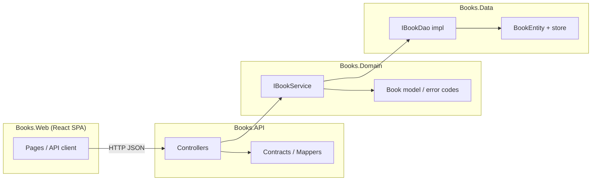
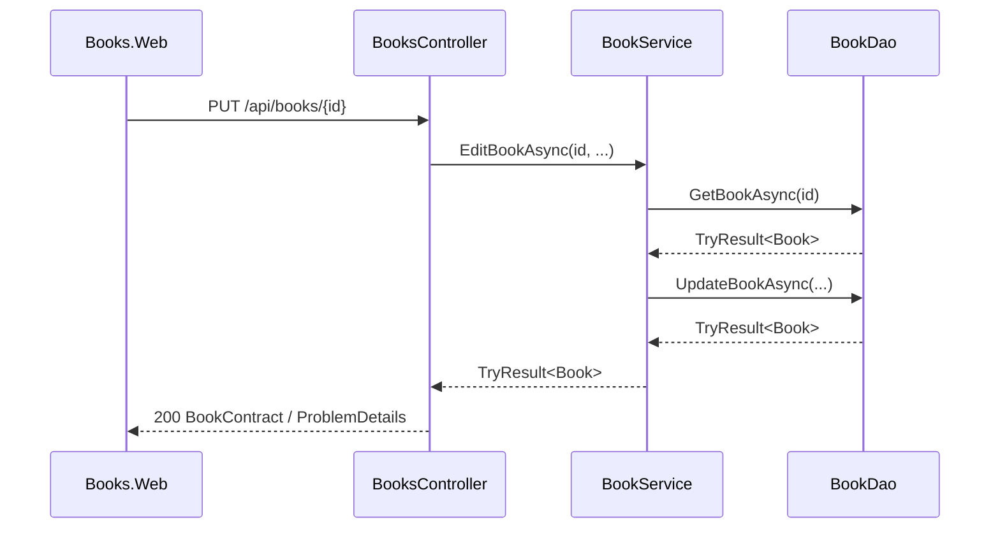

# Book Management — Tech Design Overview

## Purpose

This document describes the general technical shape of "Book Management" in this Clean Architecture template — how a book-related capability (creating, listing, viewing, editing, or removing books) fits into the existing layers. It's a reference for picking up any Book Management task from the [tracker](https://dev.develop.accounting.enos.empeek.net/projects/1652363/tasks) consistently, whatever the exact requirements turn out to be. It intentionally stops at "how the pieces fit together" — it does not prescribe database technology, validation library, pagination style, or other implementation-level choices. Those are left to whoever picks up each task, guided by [AGENTS.md](../../AGENTS.md).

## Core Concept

Book Management centers on a single resource, `Book`, and the standard operations over it:

| Operation | Typical shape |
|---|---|
| Create | `POST` a new book |
| List | `GET` a collection (search/filter/paginate) |
| View details | `GET` a single book |
| Edit | `PUT`/`PATCH` a single book |
| Delete | `DELETE` a single book |

Not every task will need every operation, and requirements for each one (fields, validation rules, edge cases) live in the tracker/Confluence — this doc only covers the shared technical shape all of them follow.

## Architecture

Every operation flows through the same layers, in the same direction; adding an operation never requires a new layer or a change in dependency direction.

Request flow is uniform regardless of which operation is involved (illustrated here with Edit, but List/View/Delete/Create follow the same shape):

## Follow the Existing Standards

Layering, error handling (`TryResult`), contracts/mappers, naming, and testing conventions are already fixed for this codebase — new operations should follow them rather than introduce alternatives. See [docs/standards/](../standards/) for the details, in particular [architecture.md](../standards/architecture.md) and [error-handling.md](../standards/error-handling.md).

## What's Intentionally Open

These are left to the implementer to decide per task, based on what that task's requirements actually need — this doc does not dictate them:

- **Persistence**: in-memory storage, a real database, or something else — and if a database, which one. Pick based on the task's needs and note the choice in the PR.
- **Pagination / filtering / search**: page/size, cursor-based, query params — driven by the specific List requirements.
- **Validation approach**: data annotations, manual checks in the service, or a validation library — pick whatever fits the existing minimal style.
- **Concurrency handling**: e.g. whether a "book was already deleted/modified" race needs special handling beyond the standard not-found error.
- **Frontend data layer**: how far `Books.Web`'s API client grows as more operations land — no framework mandate beyond what's already in place.

## Cross-Cutting Notes

- **API docs**: new endpoints are picked up automatically by the existing OpenAPI + Scalar setup (`/api/scalar` in Development) — no extra wiring needed.
- **CORS**: already enabled for local frontend dev; changes are only expected if a new client origin shows up.

## References

- [docs/standards/](../standards/) — coding standards for this template
- [AGENTS.md](../../AGENTS.md) — project overview and standards index
- Tracker project — task list and per-task requirements links
